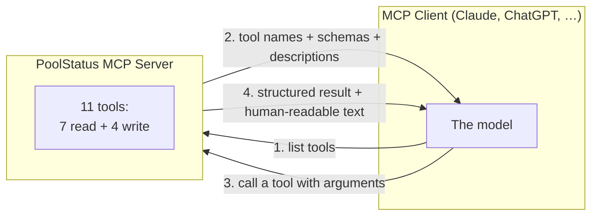
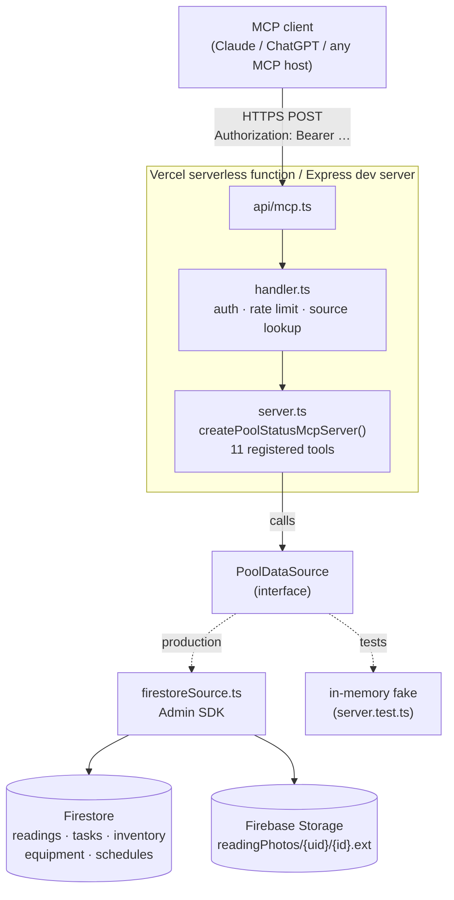
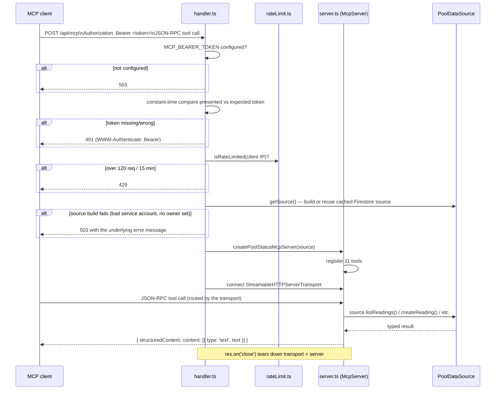
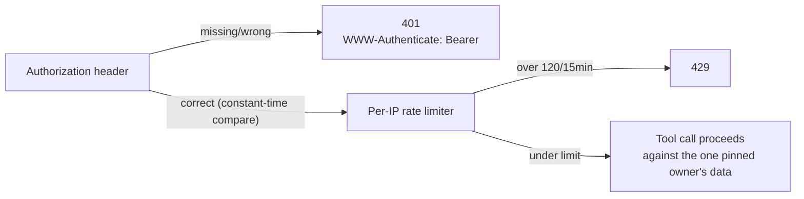
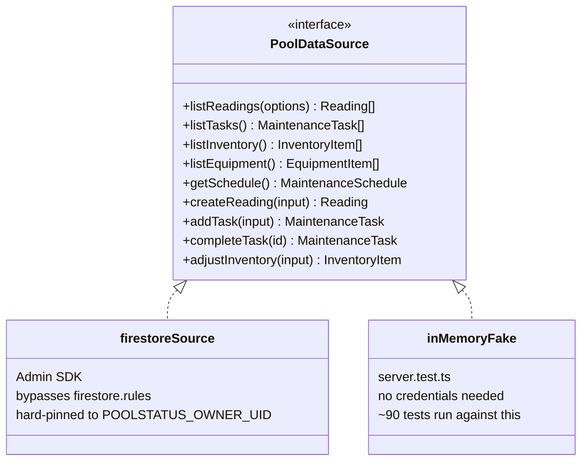
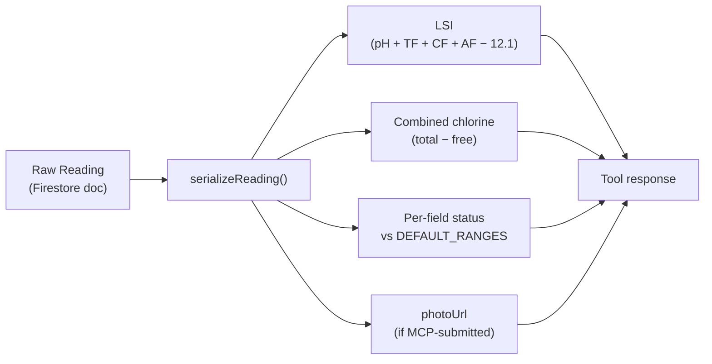
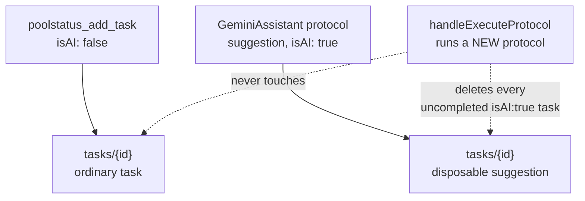
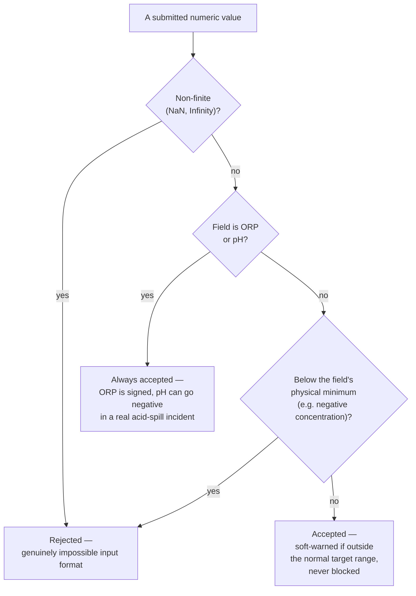

# The PoolStatus MCP Server

A deep dive into `api/mcp.ts` and `api/_lib/mcp/` — what it is, why it exists,
how it's built, and everything it can do. For the short version, see the
"MCP server" section of [`CLAUDE.md`](../CLAUDE.md). This document is the
long version, with diagrams.

## Contents

- [Why this exists](#why-this-exists)
- [What MCP is, in one page](#what-mcp-is-in-one-page)
- [Architecture](#architecture)
- [Request lifecycle](#request-lifecycle)
- [Auth and rate limiting](#auth-and-rate-limiting)
- [The `PoolDataSource` abstraction](#the-pooldatasource-abstraction)
- [Read tools](#read-tools)
- [Write tools](#write-tools)
- [Deep dive: logging a reading from a photo](#deep-dive-logging-a-reading-from-a-photo)
- [Safety model: why abnormal values are never rejected](#safety-model-why-abnormal-values-are-never-rejected)
- [Configuration](#configuration)
- [Testing strategy](#testing-strategy)
- [Known limitations](#known-limitations)

## Why this exists

PoolStatus AI already had a dashboard, a form, and an in-app AI assistant
(GeminiAssistant) for reading and reasoning about a pool's chemistry. What it
didn't have was a way for an *external* conversation — a chat with Claude or
ChatGPT that isn't running inside the app at all — to see that data, or act
on it.

The motivating scenario is ordinary and recurring: an operator is standing
at the poolside, phone in hand, mid-conversation with an AI assistant about
what to do next. They've just tested the water and want to log it. They want
to ask "what's due this week?" without opening the app. They want to note
"used the last of the acid" right when it happens, not later from memory.

Two problems fall out of that:

1. **Read access.** An AI conversation has no way to see the pool's current
   state, history, or maintenance schedule unless it's fed that data
   manually, every time, by the person typing.
2. **Write access.** Even once a conversation *can* see the data, numbers
   discussed in a conversation are just words — there's no record, no
   history entry, nothing the dashboard or GeminiAssistant will ever see
   unless the operator goes and re-enters it themselves in the app.

The MCP server solves both by exposing the same Firestore-backed pool data
that `App.tsx` reads and writes, through a standard protocol any MCP-capable
AI client already knows how to speak — no bespoke integration per client.

It shipped read-only first (list readings, trends, tasks, inventory,
equipment, schedule), then gained four write tools once the read side proved
the pattern: add/complete tasks, adjust inventory, and log a full reading —
the last one gated behind a photo requirement, described in detail below,
because a conversation has no other way to prove a number wasn't invented.

## What MCP is, in one page

MCP (Model Context Protocol) is a standard way for an AI application to
discover and call **tools** — typed functions with a name, a description,
and an input schema — exposed by some external system. The AI client (a
chat app, an IDE, a phone app) does not need to know anything about pools or
Firestore ahead of time: it asks the server "what tools do you have?", reads
each one's description and schema, and decides at conversation time whether
and how to call it.



This repo's server speaks MCP over **Streamable HTTP** — plain HTTPS POST
requests carrying JSON-RPC, no persistent socket or session required. That
matters for where it runs: Vercel serverless functions are short-lived and
stateless, so a transport that needs a long-lived connection wouldn't fit.
Streamable HTTP does.

## Architecture



Three files carry the weight:

| File | Responsibility |
|---|---|
| `api/mcp.ts` | The actual Vercel/Express entry point. Wires the shared bearer token and a cached `PoolDataSource` into the handler. |
| `api/_lib/mcp/handler.ts` | Protocol-agnostic request handling: rejects unconfigured/unauthenticated/rate-limited requests, then hands off to the MCP SDK's transport. |
| `api/_lib/mcp/server.ts` | Registers all 11 tools against a `PoolDataSource`. This is where the actual tool logic, validation, and response formatting live. |

Everything below `server.ts` — the actual reads and writes — goes through
the `PoolDataSource` interface, never directly. That indirection is what
lets `server.ts`'s ~90 tests run with no Firestore credentials at all (see
[Testing strategy](#testing-strategy)).

## Request lifecycle

Every request is stateless: a fresh `McpServer` and transport are created
per request and torn down when the response closes. There is no session,
no server-side conversation memory between calls — the MCP client re-sends
whatever context it needs on every call, same as any other stateless HTTP
API.



A misconfigured deployment — no `MCP_BEARER_TOKEN`, a bad service account,
no owner set — fails **here**, at request time, as a clean 4xx/503 with a
message naming the problem. It never reports itself healthy and only breaks
once a tool actually tries to touch Firestore.

## Auth and rate limiting

- **One shared secret.** `MCP_BEARER_TOKEN` is a single bearer token every
  client presents as `Authorization: Bearer <token>`. There's no per-client
  identity or scoping — anyone with the token can call every tool, read and
  write.
- **Constant-time comparison.** The presented and expected tokens are each
  SHA-256 hashed, then compared with `crypto.timingSafeEqual` — a naive
  `===` comparison leaks timing information proportional to how many
  leading bytes match, which is exactly what lets an attacker brute-force a
  secret byte by byte.
- **Per-IP rate limit.** 120 requests per 15 minutes per client IP
  (`rateLimit.ts`). Generous enough that a normal conversation making a
  handful of tool calls never notices it; tight enough to blunt scripted
  abuse of a leaked token.
- **Single owner, hard-pinned.** The server exposes exactly one pool
  owner's data — `POOLSTATUS_OWNER_UID` (or `POOLSTATUS_OWNER_EMAIL`,
  resolved to a uid once and cached). This is not a multi-tenant server;
  there is no concept of "which pool" in any tool call.



## The `PoolDataSource` abstraction



`server.ts` never imports Firestore, Storage, or the Admin SDK directly —
only this interface. That single decision is why:

- The full tool surface (all 11 tools, including every validation edge
  case) is unit-testable with zero external dependencies.
- A future second implementation (a different database, a different
  owner-resolution scheme) is a new class implementing this interface, not
  a rewrite of `server.ts`.

`firestoreSource.ts` is the production implementation: it talks to
Firestore and Firebase Storage through the Admin SDK, which — unlike the
client SDK the React app uses — bypasses `firestore.rules` entirely. That's
safe *only* because every query and write is hard-pinned to one owner uid
resolved from server-side configuration; there is no per-request identity
to get wrong.

## Read tools

All seven are side-effect-free and annotated `readOnlyHint: true`. Every
one accepts an optional `response_format` (`'markdown'` default, or `'json'`
for the raw structured data) so a client can render a chat-friendly summary
or parse a payload, as it prefers.

| Tool | Answers | Notable args |
|---|---|---|
| `poolstatus_get_latest_reading` | "What are the current numbers?" | — |
| `poolstatus_list_readings` | "Show me last week's readings" | `since`, `until`, `before` (pagination cursor), `limit` |
| `poolstatus_get_reading_trends` | "How has pH trended this month?" | `days` (1–90) — count/avg/min/max/direction per field |
| `poolstatus_list_tasks` | "What's still to do?" | `status` (open/completed/all), `frequency` |
| `poolstatus_list_inventory` | "What needs reordering?" | `low_only` |
| `poolstatus_list_equipment` | "Is the filter due a service?" | `due_only` |
| `poolstatus_get_schedule` | "When's the next test due?" | — |

Every reading returned by any of these three reading-related tools carries
the same derived fields the dashboard computes: per-field status against
`DEFAULT_RANGES`, the Langelier Saturation Index, combined chlorine (total −
free) and its own status, and — since this PR — `photoUrl` when the reading
was MCP-submitted with evidence.



## Write tools

Four tools, each carrying an MCP **annotation** — a protocol-level hint
that tells an MCP host whether a call needs explicit user confirmation
before running.

| Tool | Does | Annotation |
|---|---|---|
| `poolstatus_add_task` | Adds a checklist item | `WRITE_CREATE` (additive, not destructive) |
| `poolstatus_complete_task` | Marks a task done by id | `WRITE_COMPLETE` (destructive + idempotent) |
| `poolstatus_adjust_inventory` | Applies a signed delta to stock | `WRITE_DESTRUCTIVE` |
| `poolstatus_log_reading` | Logs a real reading, **photo required** | `WRITE_DESTRUCTIVE` |

Why the annotations differ is itself worth explaining, since it's the kind
of detail that's easy to get wrong and easy to skip past:

- **`poolstatus_add_task`** only ever adds a new document. Nothing existing
  changes, so it's purely additive — safe for a host to run without asking
  first, under a policy that trusts non-destructive tools.
- **`poolstatus_complete_task`** *overwrites* a task's completed state, and
  — deliberately — `PoolDataSource` has no "reopen task" method. There's no
  way to undo it through this API, which is exactly what `destructiveHint`
  is for.
- **`poolstatus_adjust_inventory`** can consume stock (`delta < 0`), which
  is also an overwrite of existing state, not an addition.
- **`poolstatus_log_reading`** also advances `schedules/{ownerUid}`
  (`lastTestDate`/`nextTestDate`), overwriting that document's existing
  values rather than just adding a new one — the same reasoning as
  `adjust_inventory`, just against a different collection.

`poolstatus_log_reading`'s `notes` field is capped at `MAX_NOTES_LENGTH`
(4000 characters), enforced in the tool's own Zod schema so an oversized
note is rejected before any photo upload happens — see "Deep dive" below
for why that ordering matters.

Two more design decisions specific to the write tools:

**Tasks added via MCP are *not* marked `isAI`.** The in-app AI assistant's
own protocol suggestions are stored `isAI: true`, and `App.tsx`'s
`handleExecuteProtocol` deletes every uncompleted `isAI: true` task the
moment a *new* protocol runs — by design, since those are meant to be
disposable, replaced-on-next-suggestion items. A reminder this MCP tool was
explicitly asked to add ("remind me to backwash Friday") is not that kind of
suggestion; it's a durable request. Storing it `isAI: false` means it
behaves like a manually-added task and survives an unrelated protocol run.



**`poolstatus_adjust_inventory` requires an explicit `unit` that must match
the item's own stored unit exactly** — no unit conversion is attempted. The
alternative (accepting a bare number) is a real hazard: "used 2 gallons"
against a litres-tracked item, applied as a bare `-2`, would silently record
the wrong quantity — potentially leaving stock on record when the operator
actually used more than the entire supply. Requiring the caller to convert
first, or rejecting the call outright on a mismatch, is the safer failure
mode.

## Deep dive: logging a reading from a photo

`poolstatus_log_reading` is the most involved tool, and the one that's been
through the most review hardening. It's worth walking through in full,
because the interesting parts are all about what happens when something
fails *partway through* a multi-step write.

```mermaid
sequenceDiagram
    participant C as MCP client
    participant T as poolstatus_log_reading
    participant V as validation
    participant U as uploadReadingPhoto()
    participant St as Firebase Storage
    participant Fs as Firestore

    C->>T: chlorine, ph, photo{data_base64, content_type}, timestamp?, …
    Note over C,T: MCP SDK schema validation runs first: notes ≤ MAX_NOTES_LENGTH,\ntimestamp (if given) must carry an explicit UTC/offset marker —\na bare date or offset-less time is rejected here, before the\nhandler (and any upload) ever runs.
    T->>V: at least one measurement present?
    V-->>T: reject if not — "a photo alone isn't a completed test"
    T->>V: getImpossibleValueError per field
    V-->>T: reject only non-finite / below physical minimum
    T->>V: timestamp within MAX_CLOCK_SKEW_MS (5 min) of now?
    V-->>T: reject implausibly-future timestamps
    T->>V: isValidBase64(data_base64)?
    V-->>T: reject malformed base64 (Buffer.from silently drops bad chars, doesn't throw)
    T->>V: matchesImageSignature(bytes, content_type)?
    V-->>T: reject bytes that aren't actually JPEG/PNG/WebP magic bytes
    T->>U: upload decoded bytes
    U->>St: file.save() — readingPhotos/{uid}/{readingId}.{ext}
    alt save() ack lost (may have landed anyway)
        U->>St: delete() unconditionally — safe, nothing references this path yet
        U-->>T: rethrow original error
    end
    U->>St: getDownloadURL(file) — unexpiring token URL
    alt getDownloadURL fails
        U->>St: delete the just-saved object
        U-->>T: rethrow
    end
    U-->>T: url
    T->>Fs: readings.doc().set({..., photoUrl, id: ref.id})
    alt set() ack lost
        T->>Fs: retry the SAME set() — idempotent, so success is definitive proof
        alt retry succeeds
            Note over T,Fs: fall through as success — no guessing needed
        else retry also fails
            Note over T,Fs: leave the photo in place and rethrow — a read here would\nstill only be a snapshot, so no finite number of retry-then-\nverify rounds can prove absence; never delete on a guess.
        end
    end
    T->>Fs: advanceSchedule() — best-effort, never fails the call
    T-->>C: reading + any soft warnings (e.g. "ORP may be too low")
```

A few things worth calling out explicitly:

**Why a photo is required at all.** A manual test in the app, or a pool
controller's own sensor reading, each have some grounding in reality that a
typed-in number from a conversation doesn't. AGENTS.md's domain rules exist
to make the historical record trustworthy; a number an AI was merely *told*
in conversation has no more evidentiary weight than a guess. Requiring a
photo of the strip, meter, or report is the one piece of independent
verification available to this tool.

**Why every failure path is this careful about cleanup.** A photo upload
and a Firestore write are two separate operations against two separate
systems — there's no single transaction spanning both. That means there are
several distinct ways a call can fail *after* partial work has already
landed, and each one has a different correct answer for whether to clean up
the photo:

- If the **Firestore write** first fails, retry it — `set()` is idempotent,
  so a successful retry is definitive proof the document now exists,
  regardless of what happened to the first attempt. No guessing required.
- If **both attempts fail**, leave the photo in place and rethrow, rather
  than trying to verify absence with a read. A rejected promise doesn't
  prove the server never got the write (acknowledgements can be lost in
  transit, or a commit can still be in flight when a client-side deadline
  lapses), and a follow-up `get()` is only a point-in-time snapshot: the
  *retry's own* commit could still land moments after such a read observed
  the document absent. No finite number of retry-then-verify rounds can
  ever produce a provably-safe "confirmed absent," so the code stops trying
  to prove one at all — an occasional orphaned Storage object is a far
  cheaper mistake than a reading whose evidence link silently breaks.
- If the **Storage upload's own save() call** is the one whose ack was
  lost, deleting is *always* safe regardless of outcome, because nothing
  can possibly reference that Storage path yet (no URL has been returned to
  any caller at that point) — this is the one case in this function where
  an unconditional delete is actually correct, not just convenient.

This is the kind of distinction that's easy to gloss over and expensive to
get wrong — a version of this exact code was flagged for exactly the
opposite mistake (unconditionally deleting) during review, which is why the
logic above ended up this granular.

## Safety model: why abnormal values are never rejected

This is the single most important domain rule in the whole server, and it
comes straight from [`AGENTS.md`](../AGENTS.md):

> **Critical requirement: out-of-range values must not prevent submission.**
> Do not reject high pH, low ORP, high chlorine, unusual alkalinity, or
> other abnormal but possible readings.

The reasoning: an abnormal reading is *exactly* the kind of data an incident
report or a "what went wrong" review needs on record. A validation rule
that silently discards the operator's actual observation because it looks
unlikely is actively harmful — worse than doing nothing.

`getImpossibleValueError` (in `src/lib/readingValidation.ts`) enforces this
distinction precisely:



Two fields — ORP (`sanitisationMv`) and pH — have **no** hard minimum at
all, unlike every other measurement. ORP is a signed electrode potential,
not a concentration; a negative reading is unusual but physically real, and
AGENTS.md calls it out specifically as "essential for incident reports."
pH can likewise fall below zero in a genuine acid-spill incident.

This is deliberately **not** the same validation the manual entry form uses
(`getHardValidationError`, which also enforces an upper plausibility
ceiling — e.g. pH ≤ 14 — to catch a human's likely typo they can immediately
notice and fix). A number an AI transcribed from a photo doesn't get that
benefit of the doubt the same way, and rejecting it loses the evidence
outright rather than just annoying a typist. Hence two different validators
for the two different entry paths, sharing the same underlying soft-warning
logic (`getSoftWarning`) once a value is accepted.

## Configuration

Set in `.env.local` (see `.env.example` for the authoritative list):

| Variable | Required | Purpose |
|---|---|---|
| `MCP_BEARER_TOKEN` | Yes | The shared secret every MCP client presents. Endpoint 503s without it. |
| `FIREBASE_SERVICE_ACCOUNT` | Yes | Service-account JSON (as a string) for the Admin SDK — Firestore + Storage access. |
| `POOLSTATUS_OWNER_UID` | Yes* | The single Firebase Auth uid whose data this server exposes. |
| `POOLSTATUS_OWNER_EMAIL` | Alternative to above | Resolved to a uid once and cached; ignored if `POOLSTATUS_OWNER_UID` is set. |

No client-side configuration is needed or possible — this is a server-only
endpoint (`api/mcp.ts`, mounted the same way on Vercel and on the local
Express dev server via `server.ts`).

## Testing strategy

`api/_lib/mcp/server.test.ts` exercises all 11 tools end-to-end — real MCP
client, real JSON-RPC round-trip over an in-process transport — against an
in-memory implementation of `PoolDataSource`, never against real Firestore
or Storage. That's what makes ~90 tests, including every validation branch
described above, runnable with zero external credentials in CI or a
sandbox.

What that in-memory fake does **not** cover: the actual Firestore/Storage
calling code in `firestoreSource.ts` — things like the ambiguous-write-ack
handling described in the [deep dive](#deep-dive-logging-a-reading-from-a-photo)
above only run for real against a live (or properly mocked) Firestore/
Storage client. Those code paths are reviewed carefully and reasoned about
explicitly rather than covered by an automated test today.

## Known limitations

- **Deleting a reading's evidence photo is currently a no-op.**
  `handleDeleteReading` in `App.tsx` best-effort-deletes a reading's
  `photoUrl` object from Storage after the Firestore document is removed,
  but no `storage.rules` exist yet to actually authorize that delete from
  client code — it quietly fails (logged to console, never surfaced as a
  failed delete). Fixing this needs ownership-scoped storage rules or a
  server-side delete path; deliberately deferred rather than rushed.
- **A `poolstatus_log_reading` call that fails after the photo is already
  uploaded can leave that photo orphaned in Storage.** As explained above,
  the code deliberately stops trying to prove the Firestore write never
  landed once a straightforward retry has also failed, rather than chase
  an unbounded regress of point-in-time reads. The accepted cost is a rare
  unreferenced Storage object on a genuine, repeated write failure — judged
  cheaper than the alternative failure mode (deleting evidence for a
  reading that actually saved). No cleanup job exists for this yet.
- **No multi-tenancy.** One deployment, one owner, one bearer token shared
  by every client. Scoping to multiple pool owners would need per-client
  identity, not just a shared secret.
- **Unbounded `readings` growth** (shared with the rest of the app, not
  MCP-specific): nothing prunes old readings, and the write tools add to
  the same unbounded collection the dashboard and history views hold
  entirely in memory. See `CLAUDE.md`'s "Known limitation" note for the
  full context — it's an accepted tradeoff pending its own dedicated fix.
